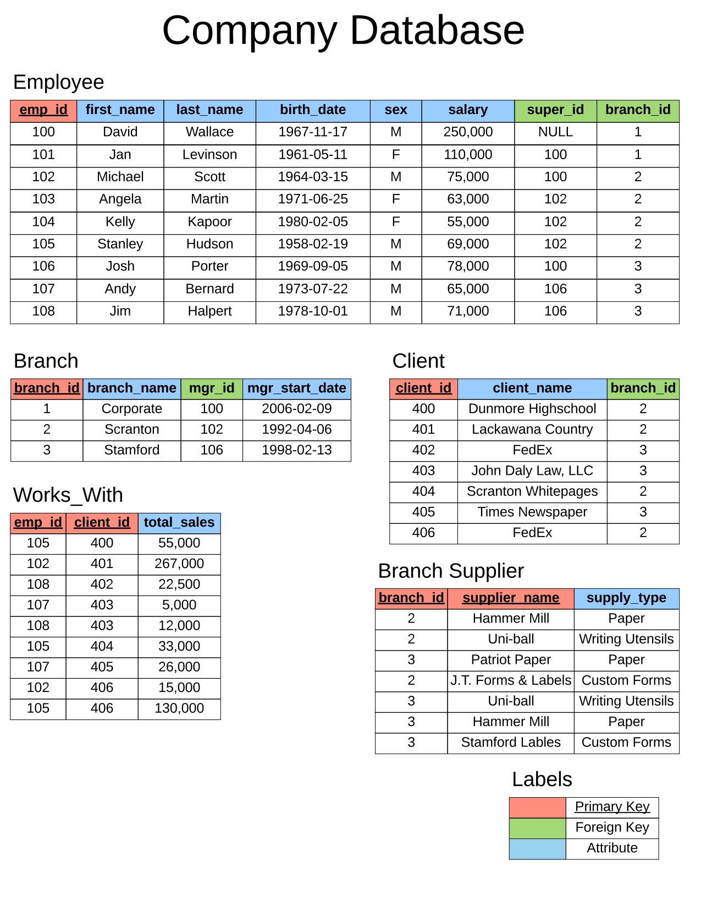

# Company DataBase

## Intro to SQL
**SQL** stands for **Structured Query Language**
It is a programming language specifically designed for managing and manipulating relational databases. 
SQL allows users to define, retrieve, and manipulate data stored in a database management system (DBMS).

**CRUD** stands for Create, Read, Update, and Delete. It is a set of basic operations that can be performed on data in a database using SQL or any other database management system.

*SQL can be divided into several categories based on the types of operations it performs:*

1.**DDL** (Data Definition Language): DDL statements are used to define and manage the structure of database objects such as tables, views, indexes, and schemas. Common DDL statements include:
- CREATE: Used to create a new database object, such as a table or view.
- ALTER: Used to modify the structure of an existing database object.
- DROP: Used to remove a database object from the database.

2.**DML** (Data Manipulation Language): DML statements are used to manipulate data within the database. They are used to insert, retrieve, update, and delete records in database tables. Common DML statements include:
- SELECT: Used to retrieve data from one or more database tables.
- INSERT: Used to insert new records into a table.
- UPDATE: Used to modify existing records in a table.
- DELETE: Used to remove records from a table.

3.**DQL** (Data Query Language): DQL is a subset of DML and is specifically used for querying and retrieving data from the database. The most common DQL statement is SELECT, which allows you to retrieve data based on specified criteria.

4.**DCL** (Data Control Language): DCL statements are used to control access to the database and manage privileges. They are used to grant or revoke permissions to database users. Common DCL statements include:
- GRANT: Used to provide specific privileges to a user or role.
- REVOKE: Used to remove specific privileges from a user or role.
___
## Company DataBase Intro

Database Schema 
: refers to the structure or blueprint of a database. It defines how the data is organized, the relationships between different data elements, and the constraints and rules that govern the data.

___

**TASK 1** : creating company database.

**TASK 2** : inserting data/information.

**TASK 3** : write basic queries to get the data for the below 15 questions mentioned. 
Q1)  Find all employees 
Q2)  Find all clients 
Q3)  Find all employees ordered by salary 
Q4)  Find all employees ordered by sex then name 
Q5)  Find the first 5 employees in the table 
Q6)  Find the first and last names of all employees 
Q7)  Find the forename and surnames names of all employees 
Q8)  Find out all the different genders 
Q9)  Find all male employees 
Q10)  Find all employees at branch 2 
Q11)  Find all employee's id's and names who were born after 1969 
Q12)  Find all female employees at branch 2 
Q13)  Find all employees who are female & born after 1969 or who make over 80000 
Q14)  Find all employees born between 1970 and 1975 
Q15)  Find all employees named Jim, Michael, Johnny or David 
 
**TASK 4** : write functions to get the data relating to numbers/mathematical operations. 
Q1)  Find the number of employees 
Q2)  Find the average of all employee's salaries 
Q3)  Find the sum of all employee's salaries 
Q4)  Find out how many males and females there are 
Q5)  Find the total sales of each salesman 
Q6)  Find the total amount of money spent by each client 

check out 

